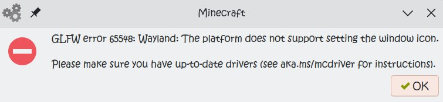
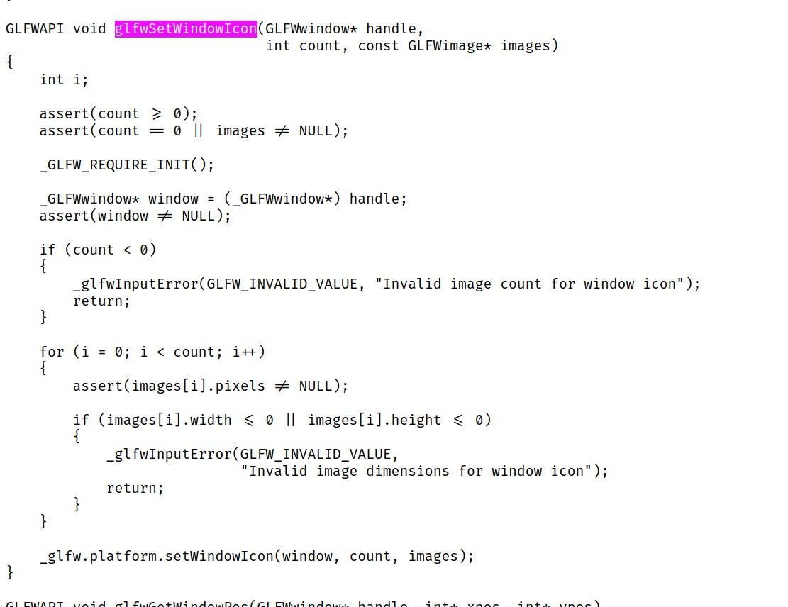

hacks to fixes this error

tested on archlinux x86_64 with Minecraft 1.20.1 (launcher: HMCL)

## I dont understand

if u enabled "use system GLFW" the game may pick up a new enough GLFW that supports wayland, minecraft currently doesn't fully support this, which it will call an unsupported GLFW function (glfwSetWindowIcon) and error everything out

if you care to run the game on linux/bsd and your DE is wayland and u dont like Xwayland this is for u

> [!IMPORTANT]
>
> this is for myself, use this at your own risk and this might not be the best solution, and it may be outdated at any time

## How to use

set LD_PRELOAD to the output library

## What is this doing

after looking at GLFW source it should be safe to just return

note the platform.setWindowIcon will call wayland implementation which just causes the error

because attempting to override the symbol via LD_PRELOAD alone failed so i decided to directly patch the instructions

(actually it also works if you attach to JVM process using GDB, i had to use root because the game was refusing ptrace access, while the game is starting, the game takes a few seconds to reach that error; i had to also call `handle SIGSEGV nostop pass` since it seems like the JVM is handling some page faults by itself, so i set a breakpoint at glfwSetWindowIcon and use the `return` command to force it return from this function, making it no-op, the game was happy to launch after doing this)
